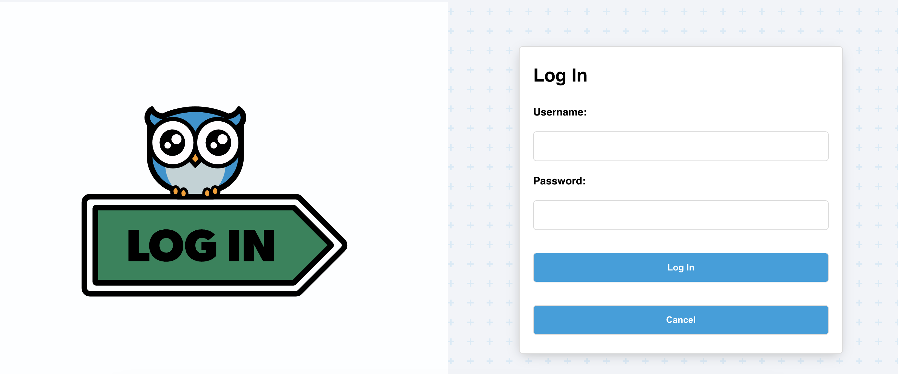
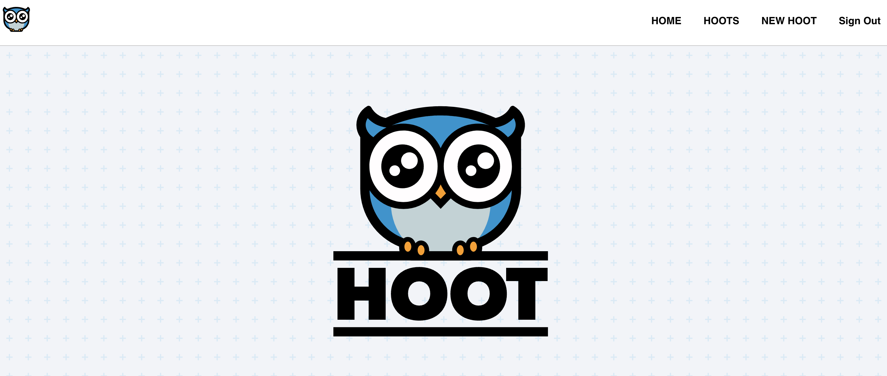
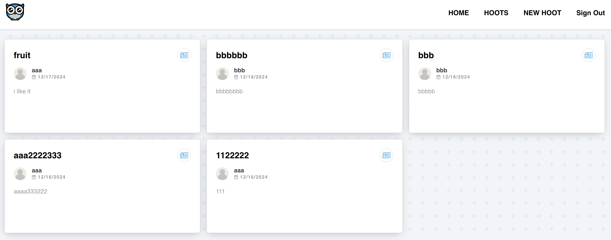
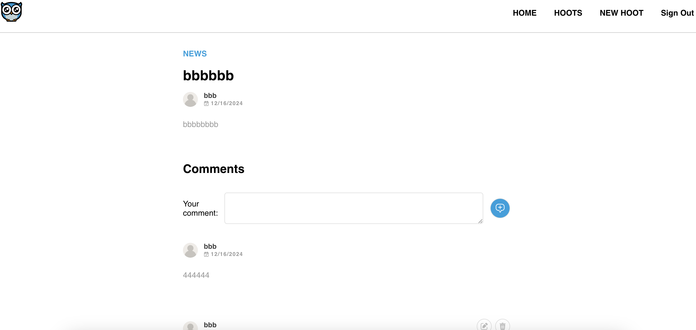
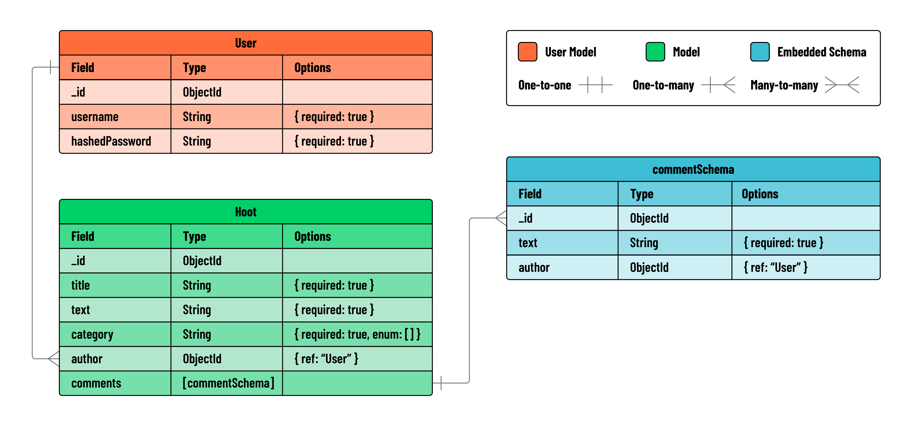

# Hoot

## Project Description

The Hoot App is like a blog which is designed to help users write their moods dailiy.

## Interact Here

[Deployed URL](https://hootblog.netlify.app/)
[GitHub URL Front-end](https://github.com/kevinsubmit/react-hoot-front-end)
[GitHub URL Back-end](https://github.com/kevinsubmit/express-api-hoot-back-end)

**Login View**

**Home View**

**Results View**

## User Stories

#### MVP Goals

- As a guest, I should be able to create an account.
- As a guest with an account, I should be able to log in to my account.
- AAU, I should be able to create a hoot post.
- AAU, I should be able to read a list of all hoots.
- AAU, I should be able to view information about a single hoot post along with its associated comments.
- AAU, I should be able to add a comment to a specific hoot.
- As the author of a hoot, I should be able to update that hoot.
- As the author of a hoot, I should be able to delete that hoot.

#### Stretch Goals

- As a user, you can upload pictures.

## ERD

## Restful Routes

| HTTP Method|  Response | Controller    | URI                      | Use Case        |
|------------|-----------|---------------|--------------------------|-----------------|
|  POST      |   200     | create        | /hoots                   |Create a hoot    |
|  GET       |   200     | index         | /hoots                   |List hoots       |
|  GET       |   200     | show          | /hoots/:hootId           |Get a single hoot|
|  PUT       |   200     | update        | /hoots/:hootId           |Update a hoot    |
|  DELETE    |   200     | deleteHoot    | /hoots/:hootId           |Delete a hoot    |
|  POST      |   200     | createComment | /hoots/:hootId/comments  | Create a comment|

